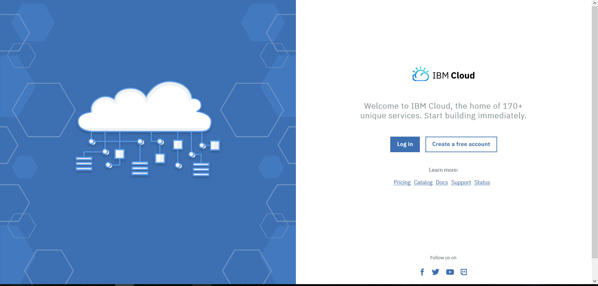
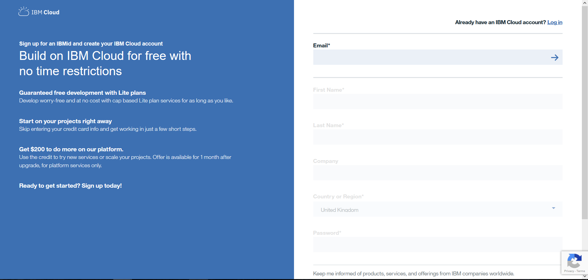
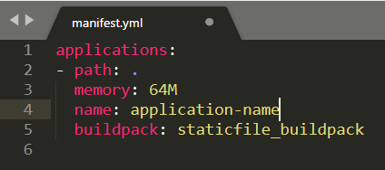
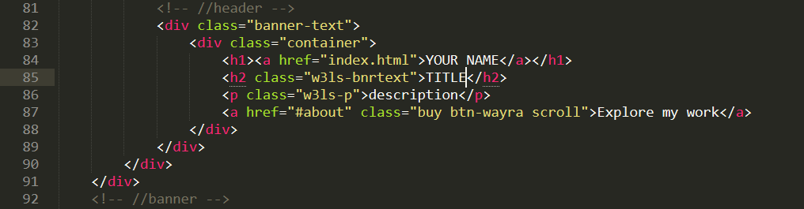
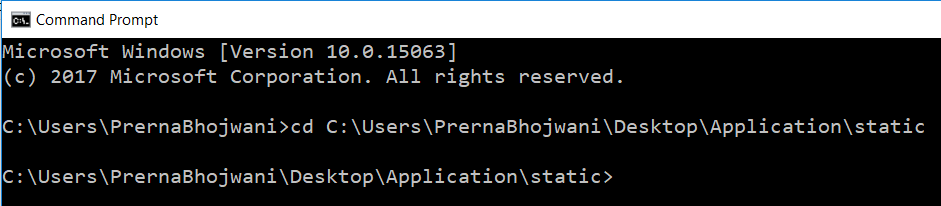
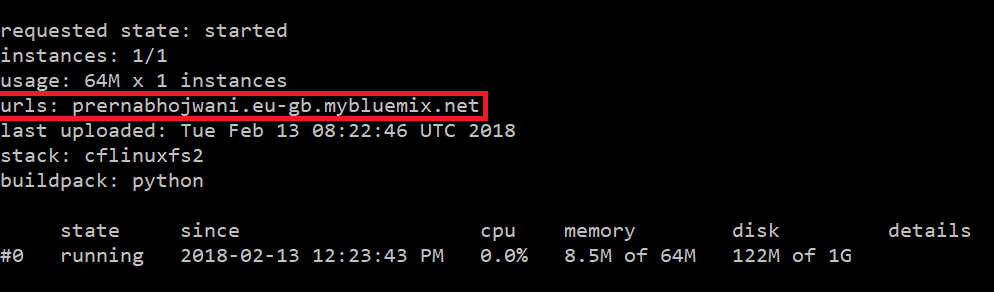
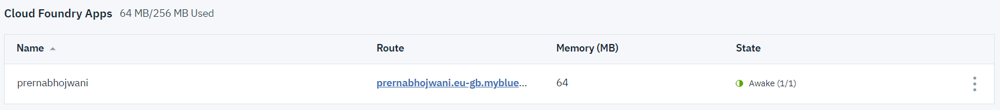

# Coffee-Code

## Create a portfolio website in 3 steps

### Step 1: Sign up for IBM Cloud and download CLI

Go to http://ibm.biz/astrolabs, click 'Create a free account' 



and fill in email, name, password, etc



Download the IBM Cloud CLI(Command Line Interface) from https://clis.ng.bluemix.net/


### Step 2: Download and modify application files

Download or clone the application files and save them from: https://github.com/prernabhojwani/Coffee-Code

Open the 'Manifest.yml' file in a text editor of your choice, and edit the name of your app.
Make sure that it is something uniques as this will be your host name too.



Next, open up the 'index.html' file to edit the information that would show up on yoor webpage such as name, title, description.



Don't forget to hit 'Save'!

### Step 3: Deploy using CLI

If you're running on Windows, open up command line(cmd)
If you're running on Mac, open up the terminal

Navigate to the folder with the application files using 'cd' followed by the folder path 



Log into your IBM Cloud account through the CLI with the following command: 

``` bx login -a https://api.eu-gb.bluemix.net -u your_email -p your_password ```

Select the organization and space in which you would create the app.

You can get these details from the IBM Cloud dashboard.

The organizatoin name usually is the same as your email and the space is usually called 'dev'. 

``` bx target -o organization_name -s space_name ```

To deploy the app:

```bx app push``` 


And voila! There you go, you just deployed a portfolio website. 

You can visit your app via the URL which can be found at the end of the ```bx app push``` command or from the IBM Cloud dashboard.






